# Hermes

<p align="center">
  
</p>

Hermes is a macOS agent written in Swift 5 designed for red team operations.

## Installation
Hermes currently supports Mythic 2.3.

Hermes requires the [Darling kernel module](https://github.com/darlinghq/darling/releases/download/v0.1.20210224/darling-dkms_0.1.20210224.testing_amd64.deb) to perform cross-compilation on the Mythic server.

It is tested for Ubuntu 20.10. After installing the Darling kernel module, as **root**, load the kernel module before starting the Hermes container:

```
modprobe darling-mach
```

To install Hermes, you'll need Mythic installed on a remote computer. You can find installation instructions for Mythic at the [Mythic project page](https://github.com/its-a-feature/Mythic/).

From the Mythic install directory, use the following command to install Hermes as the **root** user:

```
./mythic-cli install github https://github.com/MythicAgents/hermes.git
```

From the Mythic install directory, use the following command to install Hermes as a **non-root** user:

```
sudo -E ./mythic-cli install github https://github.com/MythicAgents/hermes.git
```

Once installed, restart Mythic to build a new agent.

## Notable Features
- Cross-compiling macOS payloads from Ubuntu using Darling
- Ability to load and execute JXA scripts in-memory
- Various macOS situational awareness techniques
- Upload/download
- Full file system access (ls, mv, cp, mkdir, cd, etc.)

## Commands Manual Quick Reference

Command | Syntax | Description
------- | ------ | -----------
accessibility_check | `accessibility_check` | Use `AXIsProcessTrusted()` to determine if you have the `Accessibility` permission
cat | `cat [file]` | Retrieve the output of a file
cd | `cd [directory]` | Change current directory
clipboard | `clipboard` | Monitor the clipboard for paste events. Manually stop this job with `jobkill`
cp | `cp [source] [destination]` | Copy a file
download | `download [file]` | Download a file from the target
env | `env` | List environment variables
exit | `exit` | Task agent to exit
fda_check | `fda_check` | Determine if you have `Full Disk Access` permissions, multiple methods available
get_execution_context | `get_execution_context` | Read environment variables to determine payload execution context
hostname | `hostname` | Gather hostname information
ifconfig | `ifconfig` | Gather IP addresses
jobkill | `jobkill [jobID]` | Kill a running job by ID
jobs | `jobs` | List running jobs
jxa | `jxa {"code" : "Math.PI"}` | Execute JXA code
jxa_call | `jxa_call [function]` | Execute JXA functions from an uploaded script, upload JXA scripts into memory with `jxa_import`
jxa_import | `jxa_import` | Use modal popup to upload JXA script into agent memory, call functions with `jxa_call`
list_apps | `list_apps` | List running applications with `NSApplication.RunningApplications`
list_tcc | `list_tcc [TCC.db file]` | Lists entries in TCC database (requires Full Disk Access). Schema currently only supports Big Sur
ls | `ls [path]` | List files and folders for a directory. Use `ls .` for current directory
mkdir | `mkdir [directory]` | Create a directory
mv | `mv [source] [destination]` | Move a file from source to destination
plist_print | `plist_print [file]` | Retrive contents of plist file. Supports JSON, XML, and binary
ps | `ps` | List process information
pwd | `pwd` | Print working directory
rm | `rm [path]` | Remove a file or directory
run | `run [/bin/slyd0g] [arguments]` | Execute a binary on disc with arguments
screenshot | `screenshot` | Capture all connected displays in-memory and send it back over the C2 channel, requires `Screen Recording` permissions
setenv | `setenv [name] [value]` | Set an environment variable, will overwrite existing
shell | `shell [command]` | Execute a shell command with `/bin/bash -c`
sleep | `sleep [seconds] [percentage]` | Set the callback interval of the agent in seconds with a percentage for jitter
tcc_folder_checker | `tcc_folder_checker` | Use mdquery API to check access to TCC-protected folders: `~/Downloads`, `~/Desktop`, `~/Documents`
unsetenv | `unsetenv [name]` | Unset an environment variable
upload | `upload` | Use modal popup to upload a file to a remote path on the target
whoami | `whoami` | Gather current user context

## Supported C2 Profiles

### [HTTP Profile](https://github.com/MythicC2Profiles/http)

The HTTP profile calls back to the Mythic server over the basic, non-dynamic profile. When selecting options to be stamped into Hermes at compile time, all options are respected with the exception of those parameters related to proxy servers.

## Feature Showcase

### Cross-Compiling macOS Payloads

The Hermes docker container allows you to cross-compile Mach-O binaries from Ubuntu using [Darling](https://github.com/darlinghq/darling). No need for external build systems, build all of your payloads directly from Mythic!

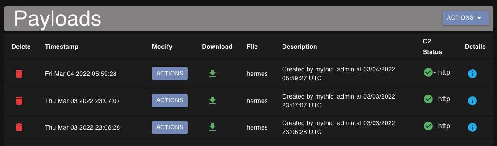

### File Triage

The `ls` command reports back a wealth of information about files/folders such as permissions, timestamps, and extended attributes. Operators can easily sort and filter files through the Mythic UI. Clicking the `ACTIONS` button will allow operators to download files directly from `ls` output. Additionally, this hooks into Mythic's native file browser.

This shows typical ls output:
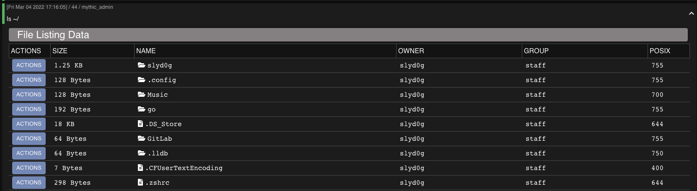

Interfaces with Mythic's filebrowser and caches data server-side:
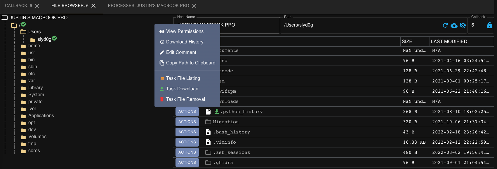

### Process and App Listings

Hermes has two different ways to retrieve information about running processes: `ps` and `list_apps`. These both will also hook into Mythic's native process browser where you can compare process listing output and observe change over time.

This shows typical ps output: 
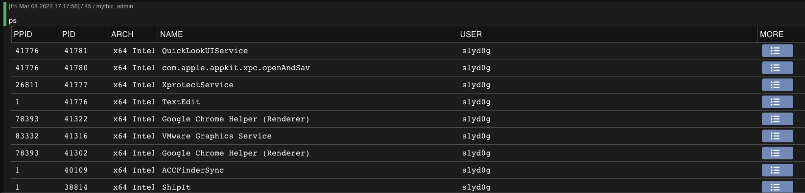

This shows typical list_apps output:
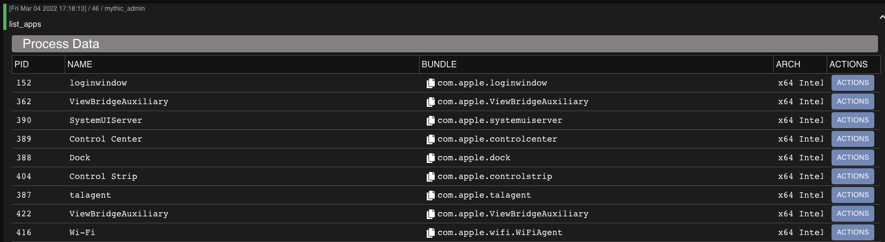

Both process listing methods also interface with Mythic's builtin process browser, which allows you to see process trees more easily.
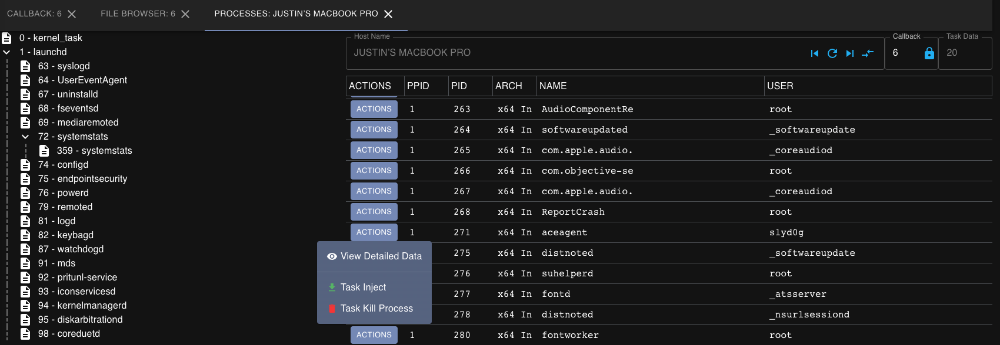

### Built-In Situational Awareness

Hermes comes with multiple situational awareness techniques built-in to help understand your current access.

This shows typical fda_check, get_execution_context, and tcc_folder_check output:
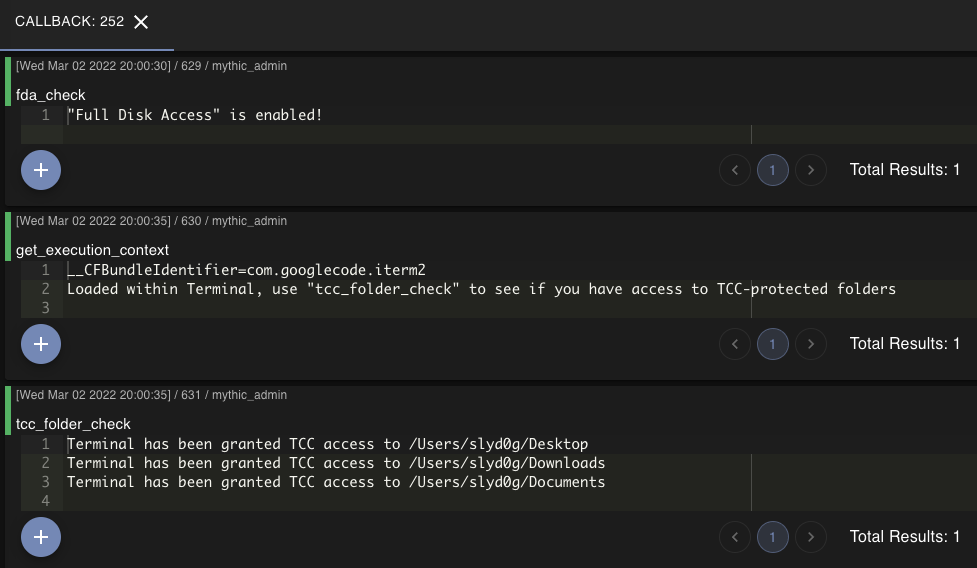 

### JXA and Third-Party Script Execution

Hermes can execute arbitrary JXA and store a JXA script in-memory to execute functions from the script. This allows operators to extend Hermes capability using the wealth of macOS post-exploitation written in JXA.

This shows typical jxa, jxa_import, and jxa_call output:
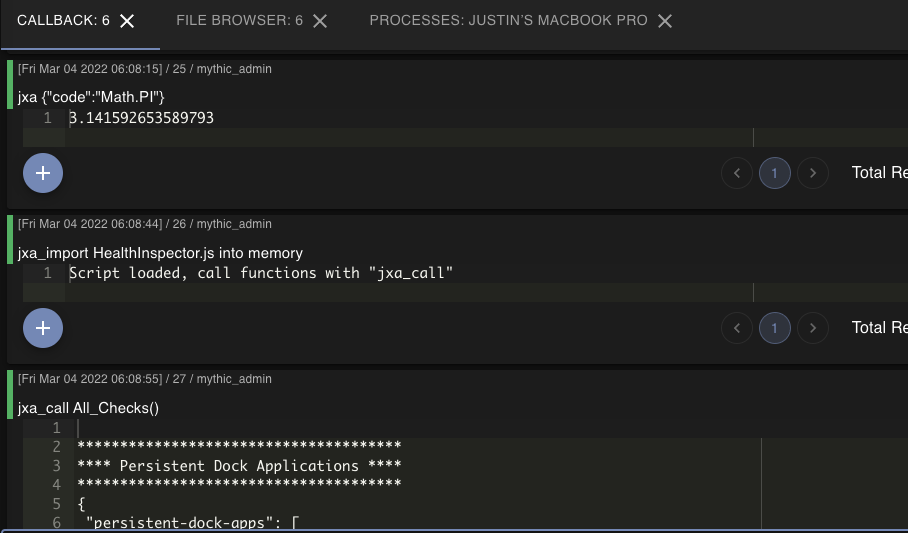

### File System Interaction

Hermes has all of your classic commands for interacting with the file system:

- `mv`
- `cp`
- `mkdir`
- `rm`
- `ls`
- `cd`
- `pwd`
- `cat`

Additionally, you can `download` files from target and `upload` files to the target:
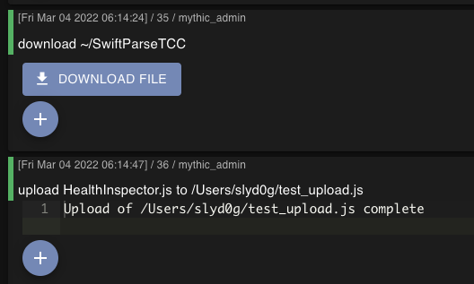

### Job Tracking

Hermes tracks all jobs with a job ID, commands, and arguments passed to the command. You can kill long-running jobs with `jobkill`

This shows typical jobs and jobkill output:
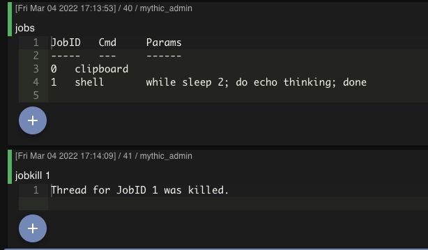

### Environment Variable Control

Hermes has the ability to list, set, and unset environment variables.

This shows typical env, setenv, and unsetenv output:
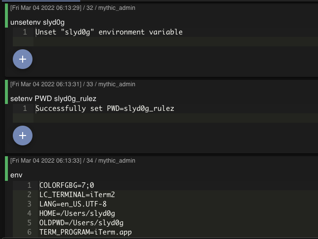

### And more!

There's a bunch of other small features and quality of life things that I didn't list. Install the agent and check it out for yourself!

## Thank you

Shout out to people who have contributed to the project either by helping me fix bugs, putting out awesome research that I re-implement, and just being awesome people

- Cody Thomas, [@its_a_feature_](https://twitter.com/its_a_feature_)
- Chris Ross, [@xorrior](https://twitter.com/xorrior)
- Cedric Owens, [@cedowens](https://twitter.com/cedowens)
- All of the other Mythic Agent developers for their work on browser scripts and other functionality that I've re-used
- Hermes icon made by [Freepik](https://www.flaticon.com/authors/freepik)
